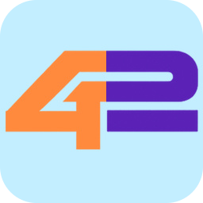

  

<h1 align="center">Work42</h1>

  An agent-native workspace for getting s*** done

Work42 is a native macOS workspace where agents and people collaborate through
structured **Sessions**, **Workflows**, **Widgets**, and **Skills**. The app is
designed as a small host with a Git-native plugin platform, so teams can shape
their workspace without forking the product.

### Open-source projects

| Repository | Purpose |
| --- | --- |
| [`work42-sdk`](https://github.com/work42-ai/work42-sdk) | Public Swift SDK, supported UI components, templates, and the plugin-creator skill. |
| [`work42-plugins`](https://github.com/work42-ai/work42-plugins) | Work42-maintained plugins built with the same public contracts available to every creator. |

The Work42 application is developed in a private organization repository while
the product and distribution model are still being prepared. The SDK and plugin
repositories are public so the extension boundary can evolve in the open.

### Build with Work42

- Create native plugin contributions for sessions, workflows, widgets, and skills.
- Build and test against the same SDK embedded in the Work42 application.
- Install from Git or a local checkout with explicit provenance and compatibility metadata.
- Publish ordinary signed Git releases—no proprietary marketplace account required.

> Work42 is in active development. Public SDK APIs and distribution guidance will
> be versioned as the first production release approaches.
